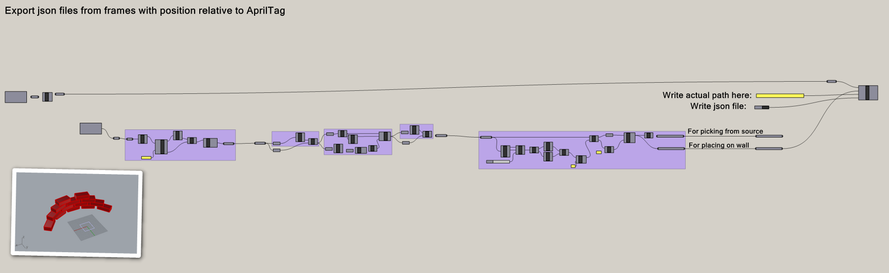
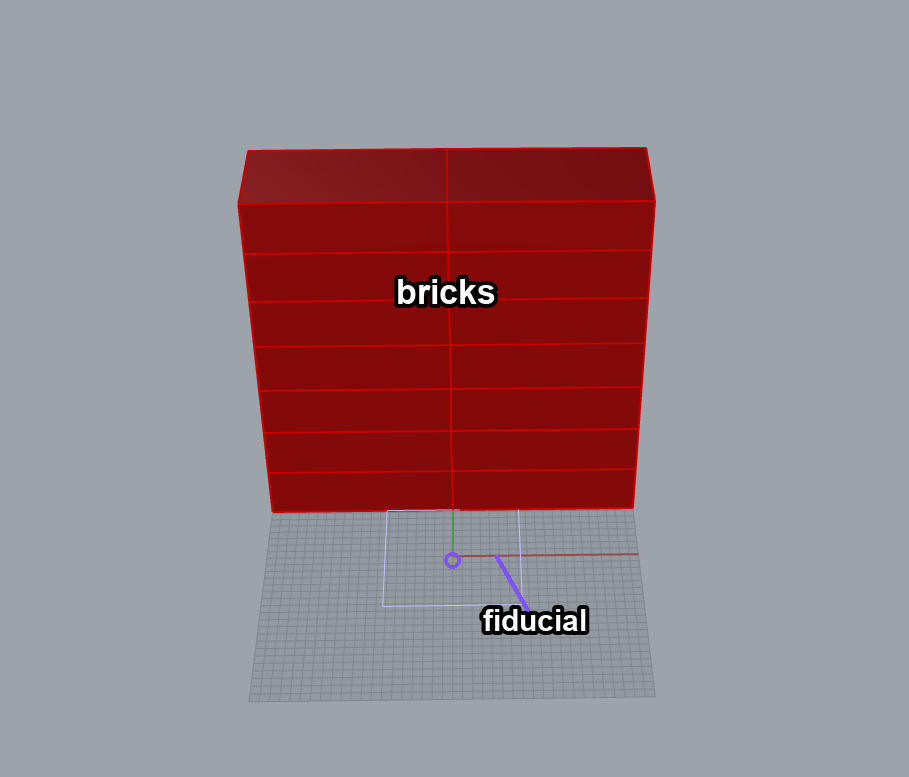
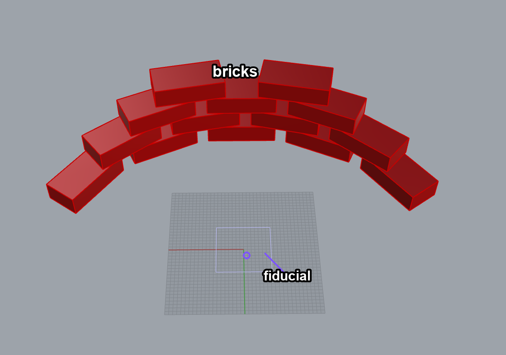

# CAD Files

These files provide the brick source and wall positions used in the experimental runs:

- `experimental_source_brick_positions.3dm` - Rhino model for source/pick positions.
- `experimental_wall_brick_positions.3dm` - Rhino model for wall/place positions.
- `source_rhino_screenshot_labeled.png` - labeled screenshot of the source model.
- `wall_rhino_screenshot_labeled.png` - labeled screenshot of the wall model.
- `bricks_to_json_script.gh` - Grasshopper workflow that exports brick-frame positions relative to the AprilTag reference frame.
- `grasshopper_canvas.png` - screenshot of the Grasshopper workflow.

`bricks_to_json_script.gh` writes the generated JSON files used by the Spot sequence:

- `src/source.json` - source/pick positions, exported in top-to-bottom sequence.
- `src/wall.json` - wall/place positions, exported in bottom-to-top sequence.

